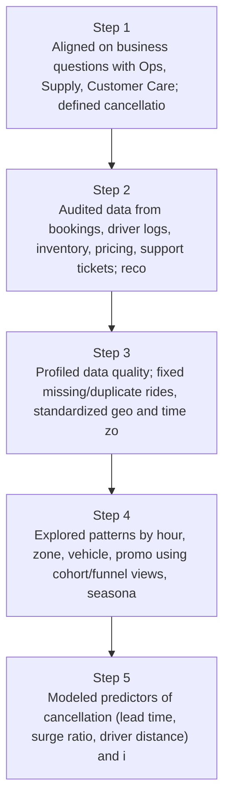
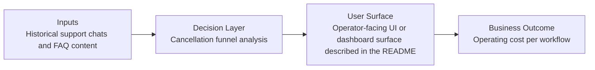
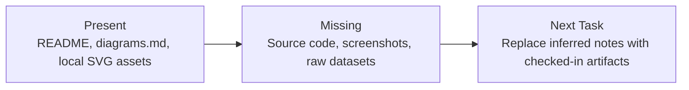

# Car-Sharing Availability EDA Diagrams

Generated on 2026-04-26T04:29:37Z from README narrative plus project blueprint requirements.

## Supply vs demand heatmap by zone/hour

## Cancellation funnel analysis

## Evidence Gap Map

